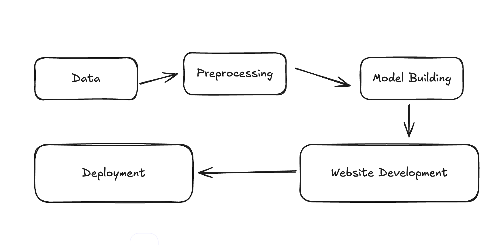

# Movie-Recommender-System
In this Project I will try to develop a movie recommender system using content based filtering and create a website for it to deploy. So this will cover a whole cycle from planning, Data processing, model building, website development to deployment ;)


##       My Basic Roadmap of the Project



# Movie Recommender System

This is a movie recommender system built using machine learning and natural language processing (NLP) techniques. The system recommends movies based on content similarity using a variety of movie features such as genres, cast, crew, keywords, and overview.

**Data Set Used**: [https://www.kaggle.com/datasets/tmdb/tmdb-movie-metadata?resource=download&select=tmdb_5000_movies.csv](https://www.kaggle.com/datasets/tmdb/tmdb-movie-metadata?resource=download&select=tmdb_5000_movies.csv)
**Live Demo:** [https://movierecommendersyste.streamlit.app/](https://movierecommendersyste.streamlit.app/)


## Features

-   **Content-based recommendation:** Suggests movies based on their similarity in terms of genres, keywords, cast, and more.
-   **TMDB Dataset:** Utilizes data from the TMDB Movie Dataset (`tmdb_5000_movies.csv` and `tmdb_5000_credits.csv`) to build the recommendation model.
-   **Streamlit Deployment:** The model is deployed using Streamlit, allowing users to input a movie name and receive recommendations.
-   **Cosine Similarity:** Recommendations are based on cosine similarity between movie tags generated from movie attributes.
-   **Movie Poster Retrieval:** Uses the TMDB API to fetch movie posters.

## Technologies Used

-   Python
-   pandas
-   NLTK (Natural Language Toolkit)
-   Scikit-learn
-   Streamlit
-   TMDB API

## Data Preprocessing

The data processing includes the following steps:

1.  **Loading Datasets:** The movies dataset (`tmdb_5000_movies.csv`) and the credits dataset (`tmdb_5000_credits.csv`) are loaded using pandas.
2.  **Merging Datasets:** The two datasets are merged based on the movie title.
3.  **Selecting Columns:** Relevant columns are selected (genres, keywords, cast, crew, overview, title). Irrelevant columns (budget, homepage, revenue, runtime, etc.) are excluded.
4.  **Data Cleaning:**
    -   Removed rows with missing values in the overview column.
    -   Modified the genres, keywords, cast, and crew columns to be in list format.
5.  **Text Processing:**
    -   Split text-based columns (overview, tagline, etc.) into individual words.
    -   Removed spaces in the names of people (e.g., "Sam Worthington" becomes "SamWorthington").
    -   Applied stemming using NLTK's PorterStemmer.
6.  **Vectorization:**
    -   Applied Bag of Words model using CountVectorizer.
    -   Excluded stopwords during vectorization.

## Recommendation System

The core of the recommendation system involves calculating cosine similarity between movie tags (genres, keywords, cast, crew, overview, and tagline).

1.  **Cosine Similarity:** Computed cosine similarity to find movies with similar tags.
2.  **Top 5 Recommendations:** Returns the top 5 recommended movies based on their similarity score.

## Example Usage

```python
def recommend(movie):
    movie_index = movies_df[movies_df['title'] == movie].index[0]
    distances = similarity[movie_index]
    distances = sorted(list(enumerate(similarity[movie_index])), reverse=True, key=lambda x: x[1])
    for i in distances[1:6]:
        print(movies_df.iloc[i[0]].title)
```

This function accepts a movie title as input and outputs the top 5 movie recommendations based on similarity.

# Movie Recommender System Deployment

This document outlines the deployment process for the movie recommender system using Streamlit.

## Deployment

Streamlit is used to create an interactive user interface for the recommender system. Users can select a movie from a dropdown list, and the system will display similar movie recommendations.

## Installation

1.  **Clone the Repository:**

    ```bash
    git clone [https://github.com/kartikeya-datta/Movie-Recommender-System.git](https://github.com/kartikeya-datta/Movie-Recommender-System.git)
    cd Movie-Recommender-System
    ```

2.  **Install Required Packages:**

    ```bash
    pip install -r requirements.txt
    ```

3.  **Run the Streamlit App:**

    ```bash
    streamlit run app.py
    ```

    After running this command, the user will be able to select a movie from a dropdown list, and the app will display the recommended movies along with their posters.

## Files in the Repository

* `movie_recommender.py`: The Python code for building the recommender system.
* `app.py`: The Streamlit app for movie recommendations.
* `movies_dict.pkl`: The dictionary containing the movie data used for recommendations.
* `similarity.pkl`: The similarity matrix used for computing cosine similarity between movies.
* `tmdb_5000_movies.csv`: The dataset containing movie details (title, genres, overview, etc.).
* `tmdb_5000_credits.csv`: The dataset containing cast and crew information.
* `requirements.txt`: The file containing the list of required Python packages.
* `LICENSE`: The license file.

## License

This project is licensed under the MIT License - see the `LICENSE` file for details.
